# Docker笔记

## 1、Docker简介

#### 1.1 前提知识

熟悉Linux命令和相关背景知识

Git/Maven相关的知识


#### 1.2 Docker是什么

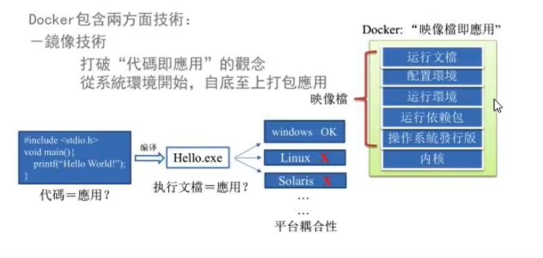

虚拟化容器技术，理念就是一次打包，处处运行，达到应用程式跨平台的无缝接轨运行

一句话解释：**解决了运行环境和配置问题软件容器，方便持续集成并有助于整体发布的容器虚拟化技术**

#### 1.3 Docker能干嘛

通过对组件的封装，分发，部署，运行等生命周期的管理，使用户的应用以及运行环境做到**“一次封装，到处运行”**

Linux容器技术的出现就解决了这个问题，Docker也就应运而生。将应用运行到Docker上面，而Docker容器技术在任何操作系统上都是一致的，这样就实现了`跨平台、跨服务器`。**只需要一次配置好环境，换到别的机子上面就可以一键部署好，大大简化了操作**

#### 1.4 Docker和传统虚拟化的区别

- 传统虚拟机技术是虚拟出一套硬件，在其上运行一个完整的操作系统，在该系统上运行所需要的应用进程
- 而容器内的应用进程直接运行于宿主的内核，容器没有自己的内核，而且也没有进行**硬件虚拟**。因此容器要比传统虚拟机更为轻便
- 每个容器之间相互隔离，每个容器都有自己的文件系统，容器之间进程不会相互影响，能区分计算资源

#### 1.5 Docker去哪下载

官网 ： https://www.docker.com/

里面有快速入门的文档  可以看着文档进行操作。


## 2、Docker安装

#### 2.1 前提条件

Docker运行在CentOS 7上，要求系统64位，系统内核版本为3.10以上

Docker运行在CentOS 6.5或者更高的版本，要求系统64位，系统内核版本为2.6.32-431或者更高版本

```shell
#查看自己系统的相关信息
$ uname -r
#查看CentOS版本信息
$ cat /etc/redhat-release
CentOS Linux release 7.8.2003 (Core)
```

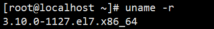


#### 2.2 Docker架构图

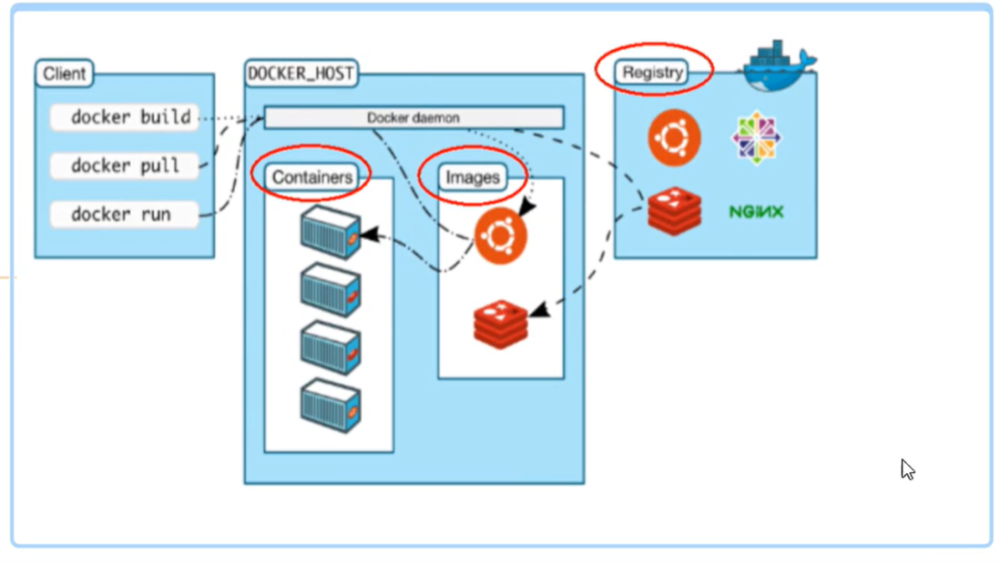

#### 2.3 Docker的基本组成

> 镜像

镜像（image）：就是一个==只读==的模板，镜像可以用来创建Docker容器，一个镜像可以创造很多个容器

容器与镜像的关系类似于面向对象中的对象与类的关系。

| Docker | 面向对象 |
| ------ | -------- |
| 容器   | 对象     |
| 镜像   | 类       |

> 容器

容器（container）：Docker利用容器独立运行的一个或一组应用，==容器是镜像创建的运行实例==，**可以把容器看作是一个简单的Linux环境。**

> 仓库

仓库（repository）：仓库是集中存放**镜像文件**的场所。仓库和仓库注册服务器是有区别的，仓库注册服务器上往往存在着多个仓库，每个仓库中又包含了多个镜像，每个镜像都有着不同的标签。

> 总结

总结：Docker本身就是一个**容器的运行载体或称之为管理引擎**。我们能把应用程序和配置依赖打包形成一个可交付的运行环境，这个打包好运行环境就似乎image镜像文件。只有通过这个镜像文件才能生成docker容器。image文件可以看作是容器的模板。Docker根据image文件生成容器的实例，同一个image文件，可以生成多个同时运行的容器实例。

- image文件生成的容器实例，本身也是一个文件，成为镜像文件
- 一个容器运行一种服务，当我们需要的时候，我们就可以通过docker客户端来创建一个对应的运行实例，也就是我们的容器
- 至于仓库，就是放了一堆镜像的地方，我们可以把镜像发布到仓库中，需要的时候从仓库拉下来就可以了。

#### 2.4 安装步骤

```shell
#较旧的 Docker 版本称为 docker 或 docker-engine 。如果已安装这些程序，请卸载它们以及相关的依赖项。
$ sudo yum remove docker \
                  docker-client \
                  docker-client-latest \
                  docker-common \
                  docker-latest \
                  docker-latest-logrotate \
                  docker-logrotate \
                  docker-engine

#在新主机上首次安装 Docker Engine-Community 之前，需要设置 Docker 仓库。之后，您可以从仓库安装和更新 Docker。
#设置仓库
#安装所需的软件包。yum-utils 提供了 yum-config-manager ，并且 device mapper 存储驱动程序需要 device-mapper-persistent-data 和 lvm2。

$ sudo yum install -y yum-utils \
  device-mapper-persistent-data \
  lvm2
#使用阿里云的镜像进行下载
$ sudo yum-config-manager \
    --add-repo \
    http://mirrors.aliyun.com/docker-ce/linux/centos/docker-ce.repo
#安装
$ sudo yum install docker-ce docker-ce-cli containerd.io

#启动 Docker
$ sudo systemctl start docker

#测试dcoker是否安装成功
$ sudo docker -v
```

####  2.5 使用阿里云镜像加速

```shell
1. 安装／升级Docker客户端
推荐安装1.10.0以上版本的Docker客户端，参考文档 docker-ce

2. 配置镜像加速器
针对Docker客户端版本大于 1.10.0 的用户

您可以通过修改daemon配置文件/etc/docker/daemon.json来使用加速器
sudo mkdir -p /etc/docker
sudo tee /etc/docker/daemon.json <<-'EOF'
{
  "registry-mirrors": ["https://smchlzgk.mirror.aliyuncs.com"]
}
EOF
sudo systemctl daemon-reload
sudo systemctl restart docker
```

#### 2.6 docker run

docker run  干了什么？

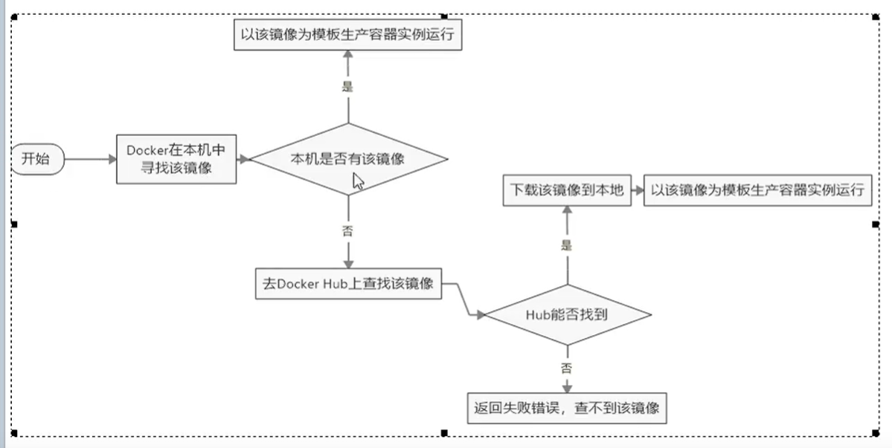


## 3、Docker的底层原理

#### 3.1 Docker 是怎么工作的

docker是一个Client-Server结构的系统，Docker守护进程运行在主机上，然后通过Socket连接客户端访问，守护进程从客户端接受命令并管理运行在主机上的容器，**容器，是一个运行时的环境，也就时我们面前说到的集装箱。**

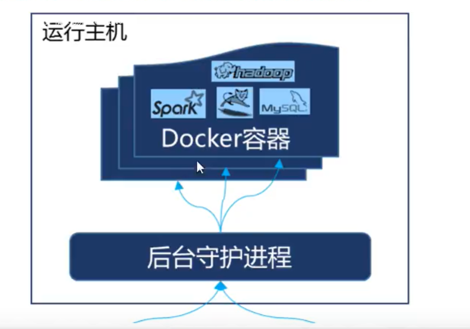 

#### 3.2为什么Docker比VM要快

1、docker有着比虚拟机更少的抽象层。由于docker不需要Hypervisor实现硬件资源的虚拟化，运行再docker容器上的程序直接使用的都是实际物理机的硬件资源。因此CPU、内存利用率上docker将会在效率上有着明显的优势。

2、docker利用的是宿主机的内核，而不需要Guest OS。因此，当新建一个容器时，docker不需要和虚拟机一样重新加载一个操作系统内核，仍而避免引寻、加载操作系统内核返个比较费时费资源的过程，当新建一个虚拟机时，虚拟机软件需要加载Guest OS,返个新建过程时分钟级别的，而docker由于直接利用宿主机的操作系统，则省略了返个过程，因此新建一个docker容器只需要几秒钟

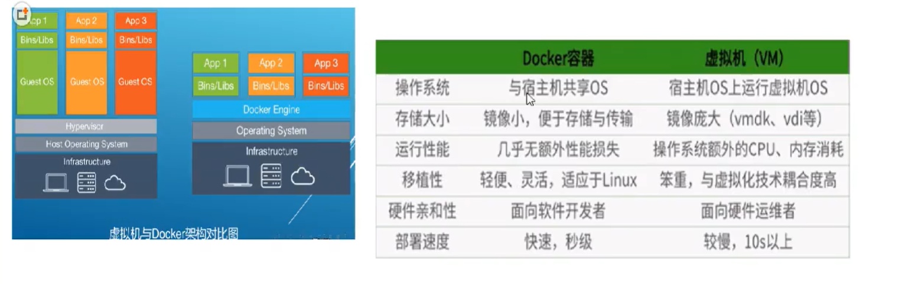


## 4、Docker的常用命令

#### 4.1 帮助命令

```shell
docker version
#docker的一些版本信息

docker info
#docker的一些具体信息

docker --help
#查看docker 命令帮助

#基本格式
docker [OPTIONS] COMMAND
```


#### 4.2 镜像命令

>docker images

```shell
#列出本地主机上的镜像
docker images

#接常用参数
docekr images -a 列出所有本地的镜像（含中间镜像层）

docker images -q 只显示镜像id

docker images --digests 显示镜像的摘要信息

docker images --no-trunc 显示完整的镜像信息
```

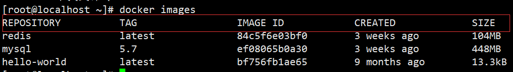

repository：表示镜像的仓库源

tag：镜像的标签

image id：镜像id

created：镜像创建时间

size：镜像大小

同一个仓库可以有多个tag，代表这个仓库源的不同个版本，我们使用repository：tag 来定义不同的镜像。

如果你不指定一个镜像的版本标签，默认将使用最新的镜像

eg:redis：latest


>docker search

```shell
#查找某个镜像
docker search xxx镜像名字

docker search --no-trunc  显示完整的镜像

docker search -s  列出收藏数不小于指定值的镜像

docker search --automated  只列出automated build 类型的镜像
```


>docker pull

```shell
#下载镜像
docker pull xxx镜像名
```


> docker rmi 

```shell
#删除镜像
docker rmi xxx镜像名

#删除单个
docker rmi -f 镜像名/id

#删除多个
docker rmi -f 镜像名1 镜像名2

#删除全部
docker rmi -f $(docker images -qa)
```


#### 4.3 容器命令

>docker run [options] image [command] 

```shell
#以交互模式并返回命令行终端运行centos 
docker run -it centos

#以守护模式运行容器(docker ps 查不到此方法运行的容器)
docker run -d centos

问题：docker ps -a 查看运行的容器，发现容器已经退出
很重要的一点:Docker 容器后台运行，就必须有一个前台进程
容器运行的命令如果不是那些一直挂起的命令（比如：top、tail），就会是自动退出的

这是docker机制的问题，比如你的web容器，以nginx为例，正常情况下，我们配置启动服务只需要启动响应的service即可。
eg:service start nginx
但是，这样做，nginx为后台进程模式运行，就导致了docker前台没有运行的应用，这样容器后台启动后，会立即自杀因为他觉得他没事可做了。
所以，最佳的解决方案就是，将你要运行的程序以前台进程的方式运行。
```

options说明：

- --name = 容器新名称，为容器指定一个名称
- -d ：后台运行容器，并返回容器id，也即守护式容器
- **-i：以交互模式运行容器，通常与-t同时使用**
- -t：为容器重新分配一个伪输入终端，通常与-i同时使用
- -P：随机端口映射
- -p：指定端口映射  四种格式1、ip:hostPort:containerPort  2、ip::containerPort   3、hostPort:containerPort  4、containerPort

​	

>docker ps

```shell
#查看当前正在运行的所有容器
docker ps [options]
```

-  -a：列出当前所有正在运行的容器 + 历史上运行过的
- -l ：显示最近创建的容器
- -n：显示最近n个创建的容器
- -q：静默模式，只显示容器编号
- --no-trunc，不截断输出

>exit  || ctrl+P+Q

退出容器

```shell
exit  容器停止退出

ctrl+P+Q  容器不停止退出
```

> docker start 

```shell
#启动容器
docker start xxx容器id/容器名
```

> docker restart 

```shell
#重启容器
docker restart xxx容器id/容器名
```

>docker stop 

```shell
#停止容器
docker stop xxx容器id/容器名

#强制停止容器
docker kill xxx容器id/容器名
```

> docker rm 

```shell
#删除已停止的容器
docker rm xxx容器id/名称

#一次性删除多个容器
docker rm -f $(docker ps -a -q)
docker ps -a -q|xargs docker rm
```

> docker logs -f -t --tail 容器id

```shell
查看容器日志
docker logs -f -t --tail x 容器id
-t 是加入时间戳
-f 跟随最新的日志打印
--tail 数字 显示最后多少条
```

> docker top 

```shell
#查看容器内运行的进程
docker top xxx容器id/容器名
```

>docker inspect 

```shell
#查看容器内的细节
docker inspect xxx容器id/容器名
```

进入正在运行的容器并以命令行交互

```shell
docker exec -it 容器id/容器名  bashShell

#重新进入docker attch 容器id/容器名

#上述2个的区别
attch  直接进入容器启动命令终端，不会启动新的进程
exec   是在容器中打开新的终端，并且可以启动新的进程
```

>docker cp

```shell
#将容器上的数据拷贝到主机上
docker cp xxx容器id:容器内路径 目的主机路径

eg：docker cp xxxx:/tmp/yum.log /root
#将xxx容器内tmp文件夹下的/yum.log文件  拷贝到宿主机的/root根目录下
```


#### 4.4 总结

```shell
Docker常用命令总结如下：

#查看docker详细信息
docker info

#获取当前节点所有容器
docker ps -a

#管理容器生命周期
docker [start|stop|restart] <containerID|containerName>

#查看容器日志
docker logs <containerID|containerName>

#查看容器详细信息
docker inspect [containerID|imageID]

#进入容器
docker exec -it <containerID|containerName> /bin/sh

#删除容器

docker rm -f <containerID|containerName>

#删除镜像
docker rmi -f <imageID|imageName:tag>

#查看正在运行的容器资源使用情况
docker stats <containerID|containerName>

#显示容器中正在运行的进程
docker top <containerID|containerName>

#更多关于docker的使用，可以通过--help查看
```


## 5、Docker镜像

#### 5.1 是什么

==镜像是一种轻量级的、可执行的独立软件包，用来打包软件运行环境和基于运行环境的开发软件==，它包含运行某个软件所需要的所有内容，包括代码、运行时、库、环境变量和配置文件

> UnionFS（联合文件系统）

联合文件系统时一种分层、轻量级并且高性能的文件系统，==**它支持对文件系统的修改作为一次次提交来一层层叠加**==，同时可以将不同目录挂载到同一个虚拟文件系统下。Union文件系统时Docker镜像的基础，镜像可以通过分层来进行继承，基于镜像基础（没有父镜像）。可以制作各种具体的应用镜像。

特性:一次同时加载多个文件系统，但从外面看起来，只能看到一个文件系统，联合加载会把各层文件系统叠加起来，这样最终的文件系统会包含所有的底层文件和目录

>Docker镜像的加载原理

docker镜像实际上由一层层的文件系统构成，这种层级文件系统被称为UnionFS

bootfs（boot file system）主要包含bootloader和kernel，bootloader主要是引导加载kernel，linux刚启动时会加载bootfs文件系统，==在Docker镜像的最底层时bootfs==。这一层与我们典型的Linux系统是一样的，包含boot加载器和内核。当boot加载完之后整个内核都在内存中了，此时内存的使用权已由bootfs转交给内核，此时系统也会卸载bootfs。

rootfs（root file system），在bootfs之上，包含的就是典型的Linux系统中的/dev，/proc，/bin，/etc，等标准目录和文件。rootfs就是各种不同的操作系统发行版。eg：centos


问:平时我们安装的虚拟机CentOS都是好几个G,为什么在docker中才200M？

解答：对于一个精简的OS，rootfs可以很小，只需要包括最基本的命令、工具和程序就可以了，因为底层直接用Host的kernel，自己只需要提供rootfs就行了，由此可见对于不同的linux发行版本，bootfs基本是一致的，rootfs会有差别，因此不同发行版本可以公用bootfs

**简单来说bootfs就是内核，rootfs就是当前系统自己额外的优化和改动**

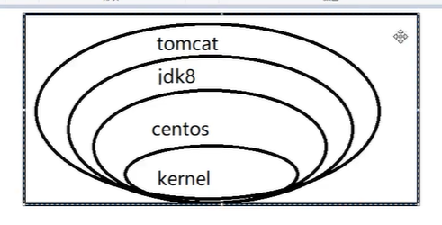

>分层的镜像

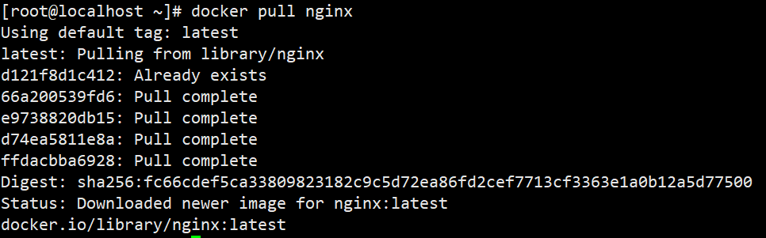

docker 镜像的下载过程好像是在一层层的下载

> 为什么docker镜像要采用这种分层结构

最大的一个好处就是---共享资源

比如：有多个镜像都从相同的base镜像构建而来，那么宿主机只需要在磁盘上保存一份base镜像，同时内存中也只需要加载一份base镜像，就可以为所有容器服务了。而且镜像的每一层都可以被共享


#### 5.2 镜像的特点

**Docker镜像都是只读的**，当容器启动时，一个新的可写层被加载到镜像的顶部，这一层通常被称为“容器层”，“容器层”之下的都叫“镜像层”


#### 5.3 Docker镜像commit操作补充

docker commit 提交容器副本使之成为一个新的镜像

docker commit -m="提交的描述信息"  -a="作者"  容器id  要创建的镜像目标名:[标签名] 

```shell
#从hub上下载tomcat镜像到本地并成功运行
docker run -it -p 8080:8080 tomcat

-p:主机端口（对外暴露的端口）:docker容器端口（docker中的真正端口）
-P:随机分配端口
i:交互
t:终端

#故意删除上一步镜像所产生的tomcat容器文档
docker exec -it 50e6cd479894 /bin/bash
cd webapps
rm -rf docs

#也即当前的tomcat运行实例是一个没有文档内容的容器，以它为模板commit一个没有doc的tomcat新镜像  tomcat02
docker commit -a="hw" -m="without docs" 50e6cd479894 hw/mytomcat:1.2

#启动新镜像和原来的对比
启动tomcat ，有docs  访问会出现tomcat的index和docs
启动hw/mytomcat:1.2 ，没有docs ，访问直接docs ：404
```


## 6、Docker容器数据卷

#### 6.1 什么是容器数据卷

理念：

- 将运用与运行的环境打包形成容器运行，运行可以伴随着容器，但是我们希望对数据的要求是持久化的。
- 容器之间希望能共享数据

为了保存数据在docker 中我们使用容器数据卷

#### 6.2 能干嘛

卷就是目录或者文件，存在一个或多个容器中，由docker挂载到容器，但不属于联合文件系统，因此能够绕过Union File System提供一些用于持续存储或共享数据的特性：

卷的设计目的就是数据的持久化，完全独立容器的生存周期，因此不会在容器删除时删除其挂载的数据卷

特点：

1、数据卷可在容器之间共享或重用数据

2、卷中的更该可以直接生效

3、数据卷的更改不会包含在镜像的更新中

4、数据卷的声明周期一直持续到没有容器使用它为止


#### 6.3 容器添加数据卷

1、-v直接命令添加

```shell
#-v命令添加容器卷
docker run -it -v /宿主机绝对路径目录:/容器内目录  镜像名

#查看数据挂载是否成功
docker inspecet centos
#出现了则说明挂载成功
"HostConfig": {
            "Binds": [
                "/myDataVolume:/dataVolumeContainer"
            ],


#以json串的形式来描述这个容器
docker inspect  容器名/id

#带权限的创建容器数据卷
docker run -it -v /宿主机绝对路径目录：/容器内目录：ro 镜像名

ro：readonly  只读  在主机内可以随意操作，但是在容器内只是可读的，不能有写操作，容器只能有查看的操作

因为怕"RW": true,这个RW为false，假设硬盘就有保护，直接去改变的话，改动不了。
```

挂载以后容器和宿主机之间数据共享

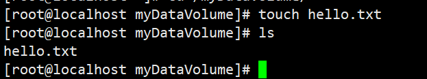

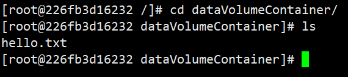

数据互通且同步

**容器停止退出后，主机修改后数据是否能够同步？**

答案：  ==能够同步==

1、先关闭容器，在主机上修改文件

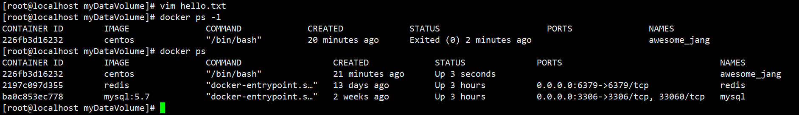

2、重新运行容器，查看文件是否同步

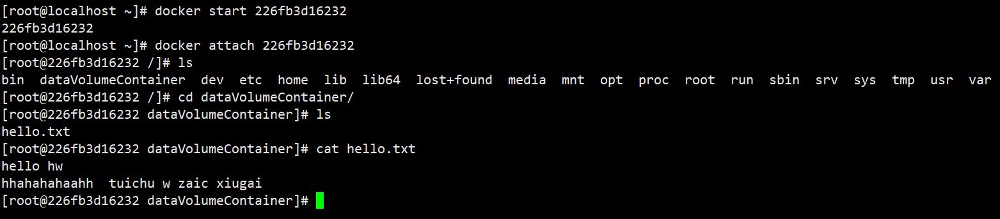

2、DockerFile添加

DockerFile 就是对镜像模板的描述信息

可在DockerFile中使用VOLUME指令来给镜像添加一个或多个数据卷，==只支持容器内的==

```shell
VOLUME["/dataVolumeContainer","/dataVolumeVContainer2","/dataVolumeContainer3"]
```

说明：出于可移植性和分享的考虑，**用-v主机目录：容器目录的方法不能直接在DockerFile中实现**

由于宿主机目录是依赖于特定宿主机的，并不能保证在所有的宿主机上的都存在这样的特定目录

步骤：

- 1、根目录下新建mydocker文件夹并进入  
- 2、可在Dockerfile中使用VOLUME指令来给镜像添加一个或多个数据卷
- 3、File构建
- 4、build后生成镜像
- 5、run容器
- 6、通过上述步骤，容器内的卷目录地址已经知道对应的主机目录地址在哪？

```shell
mkdir mydocker
vim Dockerfile

#构建file
#volume test
FROM centos
VOLUME ["/dataVolumeContainer1","/dataVolumeContainer2"]
CMD echo "finished,---------success1"
CMD /bin/bash

#build镜像
docker build -f /mydocker/Dockerfile -t hwhw/centos .

#run容器
docker run -it hwhw/centos 

#可以发现在根目录下，有我们创建好的2个容器数据卷，对应的主机目录在
/var/lib/docker/volumes/370945720efe40929df5a88302649b89f7322418ceb017c734a2ee67c1af54fd/_data下面
```

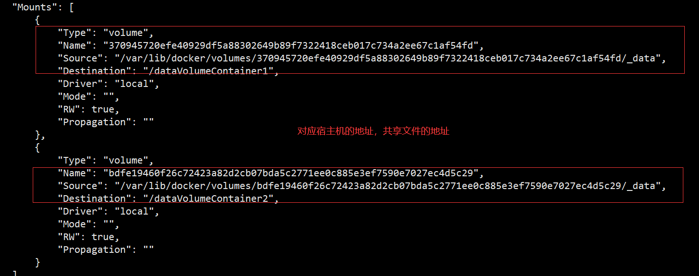

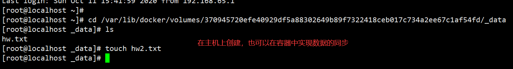

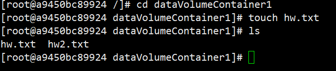

备注：Docker挂载主机目录Docker访问出现cannot open directory : Permission denied

解决办法：在挂载目录后多加一个--privileged =true参数即可

#### 6.4 数据卷容器

**命名的容器挂载数据卷，其他容器通过挂载这个（父容器）实现数据共享，挂载数据卷的容器，称之为数据卷容器**

活动硬盘上挂活动硬盘，实现数据的传递

--volumes-from：容器间的数据共享

```shell
#先启动一个父容器dc01  在dataContainer2新增内容
docker run -it --name dc01 hwhw/centos
cd /在dataContainer2
touch dc01.txt
#dc02/dc03 继承自dc01  --volumes-from 然后再dc02，dc03分别新增自己的内容
docker run -it --name dc02 --volumes-from dc01 hwhw/centos
cd /在dataContainer2
touch dc02.txt
#回到dc01可以看到02/03各自添加的都能共享
docker attch dc01
ls
#删除dc01，dc02修改后dc03可否访问
可以，并且不受影响，即使把dc01删掉，然后修改dc02的数据，dc03也可以进行同步

#删除dc02后dc03可否访问
可以，数据同步也不会收到影响
#新建dc04继承dc03后再删除dc03
docker run -it --name dc04 --volumes-from dc03 hwhw/centos
ll
查看数据，依然是存在的
删除dc03对dc04没有任何影响
只要没有死绝，都可以全量的备份的！！！
```

==结论：容器之间配置信息的传递，数据卷的生命周期一直持续到没有容器使用它为止。==

## 7、DockerFile解析

#### 7.1 DockerFile是什么？

DockerFile是用来构建Docker镜像的构建文件，是由一系列命令和参数构成的脚本

构建三步骤

- 编写docker file文件
- docker build 
- docker run

```shell
#centos 7 的dockerfile文件
FROM scratch
ADD centos-7-x86_64-docker.tar.xz /

LABEL \
    org.label-schema.schema-version="1.0" \
    org.label-schema.name="CentOS Base Image" \
    org.label-schema.vendor="CentOS" \
    org.label-schema.license="GPLv2" \
    org.label-schema.build-date="20200809" \
    org.opencontainers.image.title="CentOS Base Image" \
    org.opencontainers.image.vendor="CentOS" \
    org.opencontainers.image.licenses="GPL-2.0-only" \
    org.opencontainers.image.created="2020-08-09 00:00:00+01:00"

CMD ["/bin/bash"]
```

#### 7.2 DockerFile的解析过程

Dockerfile内容的基础知识

- 每条保留字指令都必须为大写字母且后面要跟随至少一个参数
- 指令按照从上到下，顺序执行
- #表示注释
- 每条指令都会创建一个新的镜像层，并对镜像进行提交

Dockerfile执行的大致流程

- docker从基础镜像运行一个容器
- 执行一条指令并对容器做出修改
- 执行类似docker commit的操作提交一个新的镜像层
- docker再基于刚提交的镜像运行一个新容器
- 执行dockerfile中的下一条指令直到所有指令都执行完成

小总结：

从应用软件的角度来看，Dockerfile、Docker镜像与Docker容器分别代表软件的三个不同阶段

- DockerFile是软件的原材料
- Dokcer镜像是软件的交付品
- Docker容器时则可以认为时软件运行的标志

Dockerfile面向开发，Docker镜像成为交付标准，Docker容器则涉及部署和运维。三者缺一不可，合力充当Docker体系的基石。

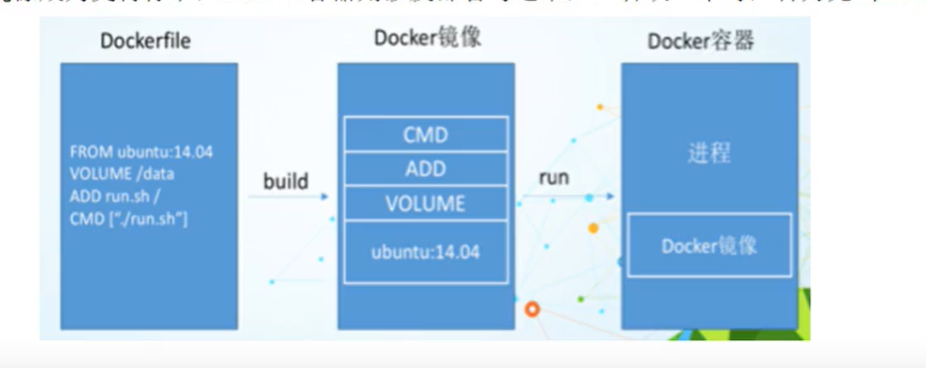

1、Dockerfile，需要定义一个Dockerfile、Dockerfile定义了进程需要的一切东西。dockerfile设计的内容包括执行代码或者时文件、环境、依赖包、运行时环境、动态链接库、操作系统的发行版本、服务进程和内核进程等

2、Docker镜像，在用Dockerfile定义一个文件之后，docker build时回产生一个docker镜像，当运行docker镜像时，会真正开始提供服务

3、docker容器，容器是直接提供服务的。

#### 7.3 保留字指令

```shell
FROM 基础镜像 ，当前新镜像是基于哪个镜像的

MAINTAINER  镜像维护者的姓名和邮箱地址

RUN  容器构建的时候需要的指令

EXPOSE  当前容器对外暴露出的端口号

WORKDIR  指定在创建容器后，终端默认登陆的进来工作目录，一个落脚点

ENV  用来在构建镜像的过程中设置环境变量

ADD  将宿主机目录下的文件拷贝进镜像且ADD命令会自动处理URL和解压tar压缩包

COPY  类似ADD，拷贝文件和目录到镜像中，将从构建上下文目录中<源路径>的文件/目录复制到新的一层的镜像内<目标路径>位置 copy src dest  /  copu ["src","dest

VOLUME  容器数据卷，用于数据的保存和持久化工作

CMD  指定一个容器启动时要运行的命令 dockerfile中可以有多个CMD指令，但是只有最后一个生效，CMD会被docker run 之后的参数替换

ENTRYPOINT  指定一个容器启动时要运行的命令，都是指定容器启动程序以及参数

ONBUILD  当构建一个被继承的dockerfile时运行命令，父镜像在被子继承后的onbuild被处触发
```

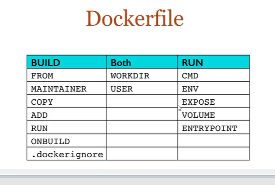

#### 7.4 自定义镜像

案例一：

我们pull下来的有的镜像不符合我们的要求

比如：要求centos具备1、登陆后的默认路径 2、vim编辑器3、查看网络配置ifconfig支持

步骤：

```shell
1、编写dockerfile
FROM centos
MAINTAINER hwhw<hw@qq.com>

ENV mypath /tmp
WORKDIR $mypath

RUN yum -y install vim 
RUN yum -y install net-tools

EXPOSE 80
CMD /bin/bash

2、构建
docker build -f  /mydocker/Dockerfile2 -t hwcentos2 .

3、运行
docker run -it hwcentos2

4、列出镜像的变更历史
dcoker history hwcentos2
```

#### 7.5 CMD-ENTRYPOINT案例

CMD-ENTRYPOINT	都是指定一个容器启动时要运行的指令

```shell
#CDM
Docekrfile中可以有多个CMD指令，但是只有最后一个生效，CMD会被docker run 之后的参数替换

dcoker run -it -p 8888:8080 tomcat ls -l
#执行上面命令会让tomcat启动不起来，把原有dockefile文件中的CMD命令给替换了

#ENTRYPOINT
docker run 之后的参数会被当做参数传递给ENTRYPOINT，之后形成新的命令组合

curl命令可以用来执行下载、发送各种http请求，指定http头部等操作
如果没有curl可以使用yum intsall curl 安装，也可以下载安装
curl是将下载文件输出到stdout

Dckerfile3
FROM centos 
RUN yum install -y curl
CMD ["curl","-s","http://ip.cn"]

docker build -f /mydocker/Dockerfile3 -t myip .

docker run -it myip

如果我们需要显示http头信息，我们需要加上参数-i

我们可以看到可执行文件找不到的报错，executable file not found 之前我们说过，跟再镜像后面的是command，运行时会替换cmd默认值
因此这里的-i替换了原来的CMD，而不是添加在原来的curl -s http://ip.cn后面，而-i 根本不是命令，所以自然找不到
那么我们希望加入-i这个参数，我们就必须重新完整的输入这个命令
docker run myip curl -s http://ip.cn -i 

！！！要想实现追加的功能 把保留字CMD替换成ENTRYPOINT即可
```

#### 7.6 自定义tomcat

1、mkdir -p /mydocker/dockerfile/tomcat9


2、在上述目录下touch c.txt


3、将jdk和tomcat安装的压缩包拷贝进上一步目录

cp /opt/apache-tomcat-9.0.8.tar.gz

4、在/mydocker/dockerfile/tomcat9目录下新建Dockerfile文件

vim Dockerfile

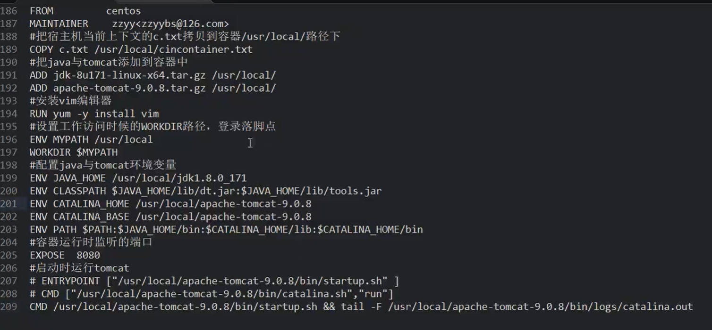

5、构建

docker build -f Dockerfile -t hwtomcat9 .

6、run

docker run -d -p 9080:8080 --name myt9 

-v /mydockek/dockerfile/tomcat9/test:/usr/local/apache-tomcat-9.0.8/webapps/test

 -v/mydocker/dockerfile/tomcat9/tomcat9logs/:/usr/local/apache-tomcat-9.0.8logs 

--privileged=true 

hwhwtomcat9

7、验证

访问localhost:9080查看是否能够访问到tomcat的主页面，能够访问就说明成功

8、结合上述的容器卷将测试的web服务test发布

#### 7.7 小总结

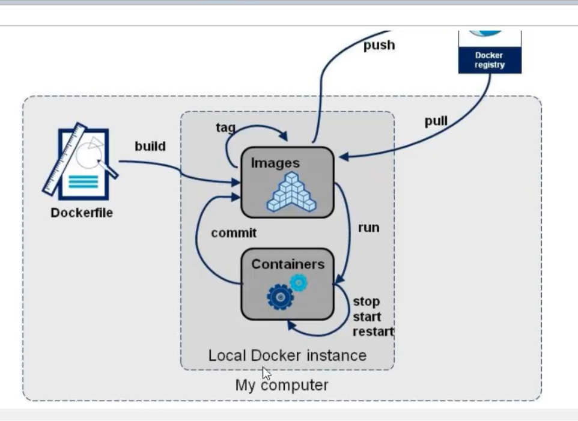


## 8、Docker的常用安装

步骤：

1、搜索镜像

2、拉取镜像

3、查看镜像

4、启动镜像

5、停止镜像

6、移除容器

eg ：安装tomcat

1、docker hub上查找镜像

docker search tomcat

2、从docker hub上拉取tomcat镜像到本地

docker pull tomcat

3、docker images查看是否有拉取到tomcat

docker images

4、使用镜像创建容器

docker run -it -p 8080:8080 tomcat

将容器的8080端口挂载到主机的8080端口


## 9、将本地镜像发布到阿里云

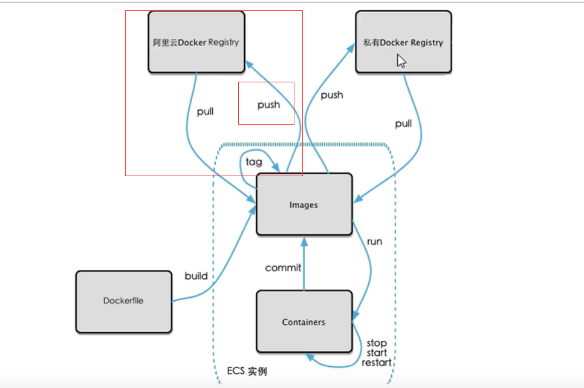

1、本地镜像素材原型

从容器创建一个新的镜像

docker commit [options] 容器id [repository[:tag]]

options说明：

-a  提交的镜像作者

-m 提交时的说明文字

2、阿里云开发者平台


3、创建仓库镜像

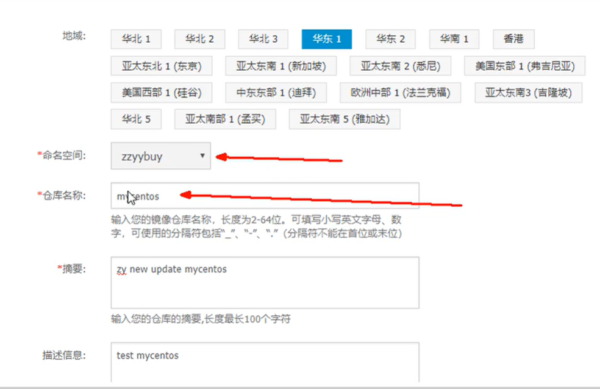

4、将镜像推送到repositry

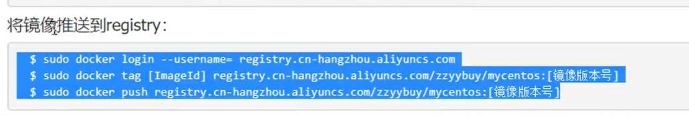

5、公有云可以查询

在阿里云的开发者平台上面可以查询自己推送上去的镜像，主机名/镜像名称

6、查看详情

复制下载命令 pull拉取即可